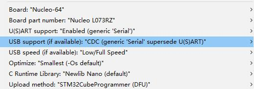

### Simple test of T-Motion GPS quality

- Installation [Arduino_Core_STM32](https://github.com/stm32duino/Arduino_Core_STM32)
- Select the following picture in Arduino=> tools

    

- Before writing, press and hold the BOOT button on the board, then insert the USB, and then click upload 
- After writing, you need to unplug it again, and then plug it in again, select the port and open the serial port to view the output information